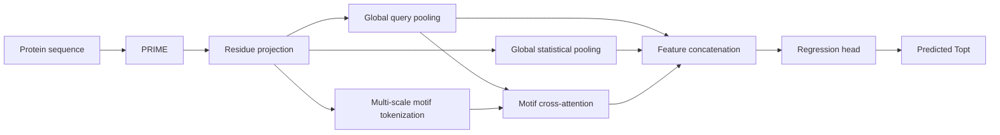

# Model Architecture

VenusTOPT combines a frozen PRIME encoder with a trainable local-global
prediction head. Only protein sequence is required for inference.

| Component | Output shape per protein |
| --- | --- |
| PRIME residue representations | L x 1280 |
| LayerNorm and linear projection | L x 320 |
| Global query pooling | 4 x 320 |
| Global mean, max, and standard deviation | 3 x 320 |
| Multi-scale motif tokens | N_motif x 320 |
| Local cross-attention features | 4 x 320 |
| Concatenated representation | 3520 |
| Regression output | 1 |

## Global Representation

Four learned queries score the projected residue representations. Masked
softmax across the sequence yields query-specific attention weights used to
pool residue features. Masked mean, max, and population standard deviation
provide complementary global statistics.

## Local Representation

Overlapping windows use length/stride pairs of 32/16, 64/32, and 128/64. Each
scale has a residue scorer and value projection. Attention within each window
produces a motif token, augmented with a scale embedding and a learned encoding
of relative position and window scale.

Global query features attend to the motif tokens through an eight-head
cross-attention block. A feed-forward network refines the cross-attention update,
which is normalized to form the local representation.

## Prediction

Global query features, local features, and global statistics are concatenated
in that order. A LayerNorm and two 512-unit GELU layers with dropout0.1 precede
the scalar output. The prediction is transformed back to degrees Celsius using
the training-target mean and standard deviation in the model configuration.

The prediction head contains 4,293,444 trainable parameters. PRIME is frozen
during head training.
